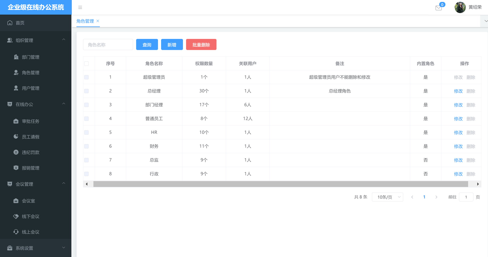
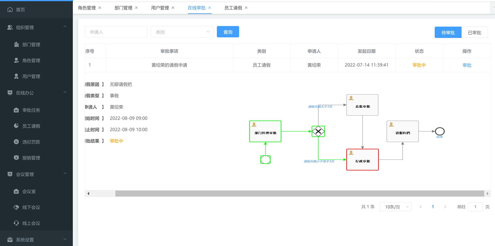
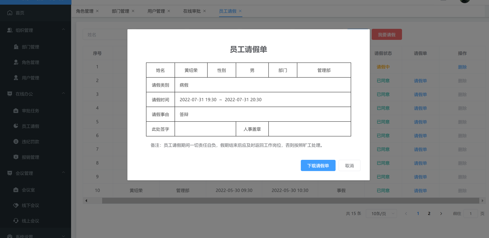
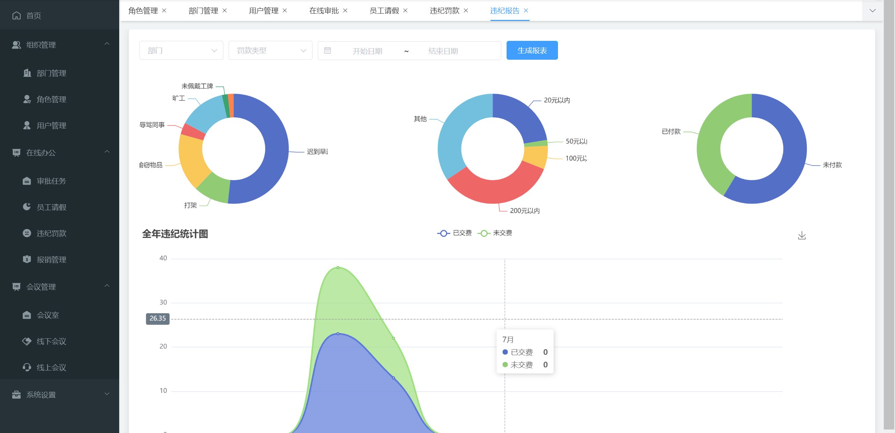
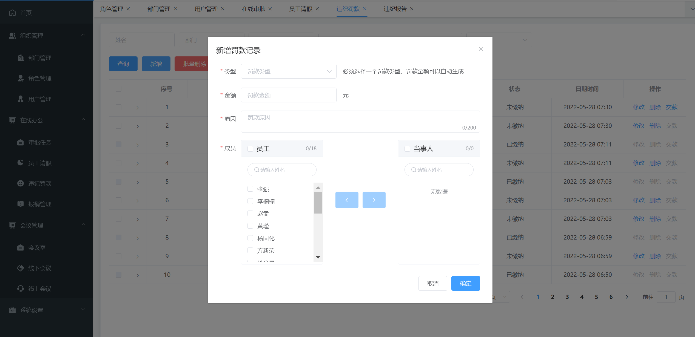
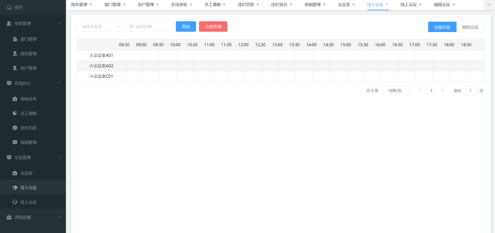
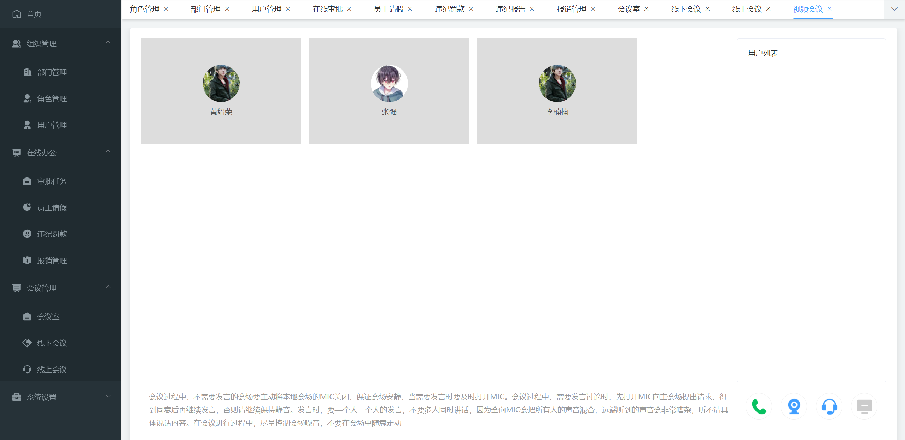
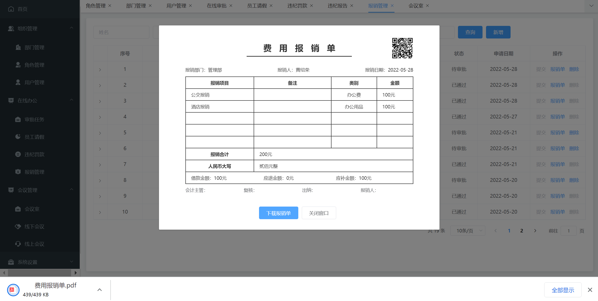
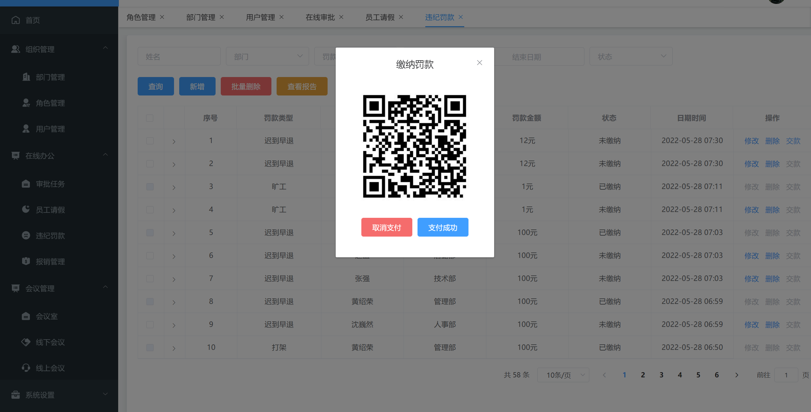
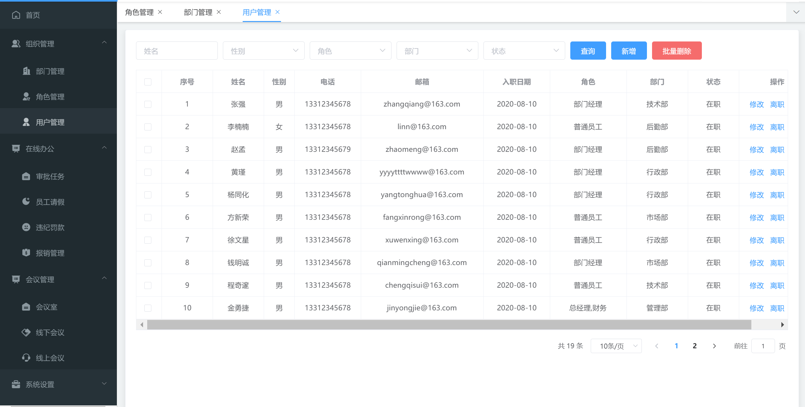

# 企业级在线办公系统

#### 介绍
本项目使用了SpringBoot+Mybatis+SpringMVC框架，技术功能点应用了WebSocket、Redis、Activiti7工作流引擎，
基于TRTC腾讯实时音视频完成在线视频会议功能

#### 技术架构
- 使用Activiti7进行工作流审批
- 使用WebSocket用于推送员工支付罚款成功界面
- 使用Redis保存在线视频会议id

#### 前端项目
https://gitee.com/huangsr/emosvue

#### TRTC（腾旭实时音视频）配置
https://cloud.tencent.com/product/trtc

#### 部分截图

